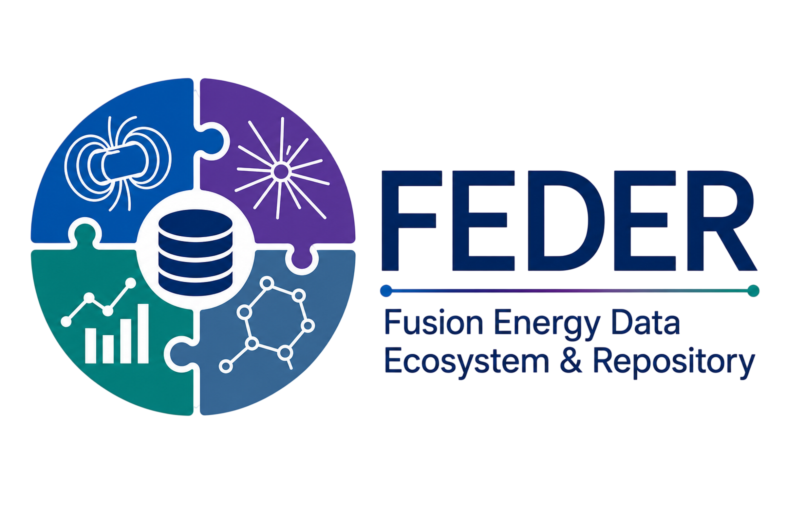

# FEDER Documentation

This is the official documentation site for the [National Fusion Energy Data Ecosystem and Repository (FEDER)](https://feder.nationaldataplatform.org/).

## Welcome to FEDER 

The fastest path to fusion runs through shared, reusable knowledge. Today we're launching FEDER, the Fusion Energy Data Ecosystem and Repository, to make that real.

Fusion research generates an extraordinary wealth of data, but too much of it lives in silos scattered across labs in non-standard formats, making it hard to discover and harder to reuse. FEDER changes that.

!!! info
    FEDER is funded by the U.S. Department of Energy (DOE) under the Fusion Innovative Research Engine (FIRE) Collaborative initiative.